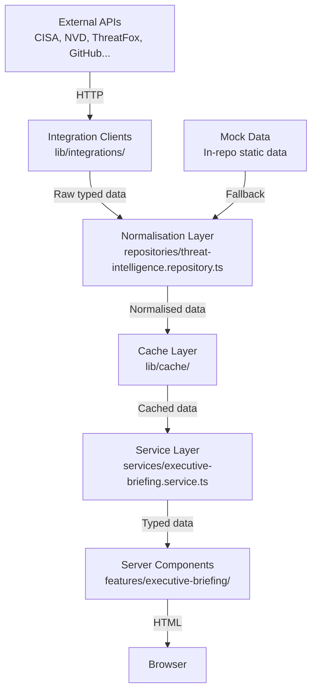
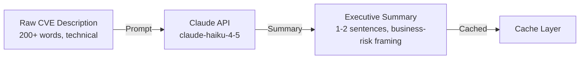

# Threat Intelligence Architecture

This document describes the complete technical architecture for the threat intelligence system that powers the Executive Security Briefing section and will power the Intelligence Hub.

Related documents:
- [API_INTEGRATIONS.md](API_INTEGRATIONS.md) — per-source specifications
- [ADR-0007](adr/0007-threat-intelligence-strategy.md) — strategic decision record
- [ARCHITECTURE.md](ARCHITECTURE.md) — system-wide architecture

---

## Overview

The threat intelligence system follows a **layered architecture** that separates data acquisition, normalisation, caching, and presentation. Each layer has a single responsibility. The UI layer never knows where data comes from.



---

## Layer 1: Integration Clients

**Location:** `lib/integrations/`

**Responsibility:** HTTP communication with external APIs. Each client is a thin wrapper that:
1. Constructs the request (URL, headers, auth)
2. Sends the request via `lib/api/client.ts` (handles timeout, retry, error)
3. Returns the raw API response typed as-received

**Principles:**
- No data transformation at this layer — return the raw shape
- No business logic — just network communication
- Authentication credentials read from environment variables only, never hardcoded
- All clients export a plain object with named methods (not a class)

**Example pattern:**
```typescript
// lib/integrations/cisa.client.ts
export const cisaClient = {
  async getKEV(): Promise<CisaKevResponse> {
    const response = await apiClient.get<CisaKevResponse>(CISA_KEV_URL)
    return response
  }
}
```

**Files:**
```
lib/integrations/
├── index.ts              # Re-exports all clients
├── cisa.client.ts        # CISA KEV
├── nvd.client.ts         # NVD CVE database
├── threatfox.client.ts   # ThreatFox IOCs
├── github-advisory.client.ts
├── abuseipdb.client.ts
├── shodan.client.ts
├── virustotal.client.ts
├── exploit-db.client.ts
├── opencti.client.ts
├── resend.client.ts      # Email delivery (not threat intel)
└── calendly.client.ts    # Booking (not threat intel)
```

---

## Layer 2: API Client (HTTP Infrastructure)

**Location:** `lib/api/client.ts`

**Responsibility:** Reliable HTTP with timeout, retry, and error handling.

**Features:**
- Configurable timeout (default 8 seconds)
- Exponential backoff retry (default 3 retries)
- `ApiError` class with HTTP status code for structured error handling
- Does not retry 4xx errors (client errors are not transient)

**Usage:**
```typescript
const apiClient = createApiClient({ baseUrl: 'https://api.example.com', retries: 3, timeout: 8000 })
const data = await apiClient.get<ResponseType>('/endpoint')
```

---

## Layer 3: Normalisation

**Location:** `repositories/threat-intelligence.repository.ts`

**Responsibility:** Transform raw API responses from multiple different schemas into a single, consistent normalised format that the rest of the application understands.

**Why this matters:** CISA returns vulnerabilities differently from NVD, which returns them differently from ThreatFox. The application should never have to handle these differences — the repository does it.

**Normalised types:**
```typescript
interface ThreatFeedItem {
  id: string
  title: string
  source: string          // 'CISA' | 'NVD' | 'ThreatFox' | 'GitHub' | ...
  severity: Severity      // 'CRITICAL' | 'HIGH' | 'MEDIUM' | 'LOW' | 'INFO'
  publishedAt: string     // Human-readable relative time
  summary: string
}

interface CVEItem {
  id: string              // CVE-YYYY-NNNNN format
  description: string
  severity: Severity
  cvssScore: number
  publishedAt: string
  affectedProducts: string[]
}

interface ThreatMetrics {
  criticalCount: number
  highCount: number
  mediumCount: number
  newToday: number
  activeCampaigns: number
  globalRiskScore: number
  globalRiskLevel: 'CRITICAL' | 'HIGH' | 'ELEVATED' | 'MODERATE'
}
```

**Deduplication:** When multiple sources report the same CVE, the repository deduplicates by CVE ID, preferring the source with the most detail.

**Current state:** The repository currently returns mock data matching the normalised schema exactly. Replacing mock data with live API calls requires only changing the repository implementation — no other files change.

---

## Layer 4: Cache

**Location:** `lib/cache/`

**Responsibility:** Prevent repeated API calls for data that does not change frequently.

**Strategy:**

| Source | TTL | Rationale |
|---|---|---|
| CISA KEV | 4 hours | Updated daily; 4h polling is sufficient |
| NVD / CVE | 15 minutes | More frequent updates; higher query cost |
| ThreatFox | 30 minutes | Regular IOC publication |
| GitHub Advisories | 60 minutes | Low frequency of critical advisories |
| AbuseIPDB | 24 hours per IP | IP reputation is relatively stable |
| Shodan | 24 hours | Internet topology changes slowly |

**Implementation options (in priority order):**
1. **Next.js `fetch` cache** with `next: { revalidate: N }` — zero infrastructure, works on Vercel
2. **In-memory cache** (`lib/cache/`) — suitable for single-instance deployments
3. **Redis** — required only if multiple server instances need shared cache (not needed currently)

**Cache key format:** `threat-intel:[source]:[query-hash]`

---

## Layer 5: AI Summarisation Pipeline (Planned)

**Purpose:** Raw CVE descriptions from NVD are technical and verbose. AI summarisation produces the concise, executive-readable summaries that appear in the threat feed.

**Architecture:**



**Prompt design:**
```
Summarise this security vulnerability for a non-technical executive audience in 1-2 sentences. 
Focus on business impact and what systems are affected. Avoid jargon.
CVE: {id}
Description: {raw_description}
CVSS Score: {score}
```

**Caching:** Summaries are cached indefinitely per CVE ID — once a CVE description is summarised, the summary is reused. CVE descriptions do not change after publication.

**Cost management:** Only CRITICAL and HIGH severity CVEs are summarised. MEDIUM and below use the raw description (truncated).

**Status:** Planned — implementation after live API connections are established.

---

## Layer 6: Service Layer

**Location:** `services/executive-briefing.service.ts`

**Responsibility:** Compose data from the repository and prepare it for rendering. This is where:
- Multiple repository calls are combined into a single response
- Data is sorted (most recent first, highest severity first)
- Limits are applied (top N items for the feed)
- Computed values are derived (e.g., globalRiskLevel from score)

---

## Layer 7: Frontend Rendering

**Location:** `features/executive-briefing/`

**Components:**

| Component | Type | Responsibility |
|---|---|---|
| `ExecutiveBriefingSection` | Server | Fetches data via service; composes child components |
| `ThreatSummaryPanel` | Client | Animated threat metrics display |
| `RiskMetricsPanel` | Server | Static risk metric cards |
| `LiveIntelFeed` | Client | Scrolling threat feed with real-time appearance |

**Data flow:** Server Component fetches data at request time → passes as props to child components → Client Components receive pre-fetched data (no client-side API calls).

---

## Error Handling

**Principle:** The UI must never break because a threat intelligence API is unavailable.

**Layered fallbacks:**
1. **Network error** → retry (3 attempts with backoff)
2. **All retries fail** → return cached data
3. **No cache** → return mock data
4. **Mock data** → always available; the UI renders correctly

**No error state visible to visitors.** The threat feed either shows data or shows the last-known data. A visitor will never see an error message because a third-party API is down.

---

## Scheduling and Refresh

**Current (Phase 1):** No scheduled refresh — data is static (mock).

**Phase 2 (live APIs):**
- Next.js `fetch` revalidation handles the refresh schedule server-side
- No cron job required for basic implementation
- Each API call includes `next: { revalidate: TTL }` where TTL matches the source's refresh interval

**Phase 3 (if needed):**
- Background refresh via Next.js Route Handler polling (avoids cold-start revalidation latency for critical feeds)
- Or a simple Vercel Cron Job calling a `/api/refresh-intel` route

---

## Security Considerations

- All API keys are server-side only (`RESEND_API_KEY`, `NVD_API_KEY`, etc.) — never in `NEXT_PUBLIC_*` variables
- The integration clients are never imported in Client Components
- API responses are validated with Zod at the repository boundary — malformed data from an external source cannot corrupt the application state
- Rate limits are respected; exponential backoff prevents hammering APIs under degraded conditions

---

## Future Extensibility

### Adding a New Source

1. Create `lib/integrations/[source].client.ts` following the existing pattern
2. Export from `lib/integrations/index.ts`
3. Add the raw response type to the client file
4. Add a normalisation function in `repositories/threat-intelligence.repository.ts`
5. Update `API_INTEGRATIONS.md` with the integration specification
6. Write a test for the normalisation function

### Adding AI Enrichment to an Existing Source

1. Add a `summarise(rawDescription: string): Promise<string>` call in the normalisation layer
2. Wrap with the cache layer using CVE ID as the cache key
3. No changes to the service or UI layers

### Scaling to Multiple Server Instances

Replace the in-memory cache with Redis. The cache interface (`lib/cache/`) abstracts the implementation — swap the backing store without changing any other code.
